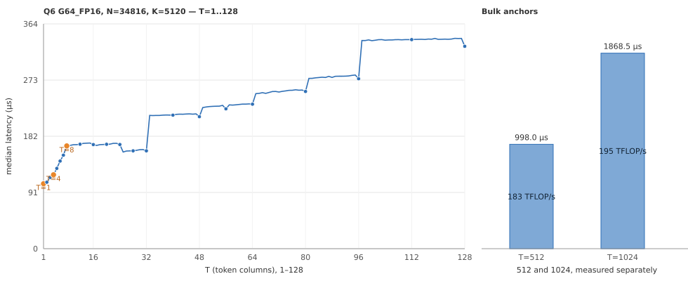

# Q6 Linear 性能报告：N=34816，K=5120

2026-09-19 测量。本文记录 `text/layers/*/mlp/gate_up` 在 Q6 权重下的完整 Linear Op 性能，
供评估该 shape 和后续调优参考。

## 测量对象与条件

| 项目 | 本次测量 |
|---|---|
| 权重 | `Q6_G64_FP16`，row-split layout；每 64 个权重共享一个 FP16 scale，另有 16 字节高位平面 |
| 数学形状 | `W[34816,5120] × X[5120,T] → Y[34816,T]` |
| 输入、输出与 policy | BF16 输入、BF16 输出，`A16Only` |
| GPU / 工具链 | NVIDIA GeForce RTX 5090；CUDA 13.4，Release，`sm_120a` |
| 计时入口 | `ninfer::ops::linear`；每个 CUDA Graph 包含一次完整 Op 调用 |
| cache / 采样 | 每个样本前清除 256 MiB L2；5 次 warmup、50 次测量，报告 median |
| 输入 fixture | 使用公开 bench 的 Q6 packed-weight 与 BF16 activation fixture |
| 覆盖 | T=1～128 每个整数；512、1024 两个大 T 锚点 |
| 并发条件 | 测量时同机有一个空闲的常驻 NInfer 服务占用显存；bench 每样本清 256 MiB L2 |

当前被测调用均只有一个 Graph kernel 节点，外部 workspace 为零。测量范围是纯 Linear Op。

## 最终耗时曲线



左图包含全部 128 个实测点，圆点标出重点 T，橙色强调 T=1、4、8。
右图分别展示 512、1024。图中连线仅连接相邻实测点。

## 逻辑带宽与 Tensor Core 利用率

权重包含 `34816 × 5120 / 64 × 50 = 139,264,000` 字节（32 字节低位码 + 16 字节高位平面 +
2 字节 FP16 scale，每 64 个权重一组）。沿用
[Linear bench 指标定义](../linear-benchmark.md#5-数学工作量与-route-neutral-指标)：

```text
model_bytes = 139,264,000 + 2 × 5120 × T + 2 × 34816 × T
逻辑带宽 GB/s = model_bytes / seconds / 1e9
带宽利用率 = 逻辑带宽 / 1792 GB/s × 100%

有效算力 TFLOP/s = 2 × 34816 × 5120 × T / seconds / 1e12
TC 利用率 = 有效算力 / 209.5 TFLOP/s × 100%
```

分母取自 bench 的 RTX 5090 固定规格常量。T=1 使用 GEMV，TC 利用率填 `—`；T≥2 的最终路径
均使用 BF16 输入、FP32 累加的 dense MMA，使用对应的 **209.5 TFLOP/s** 峰值。
当前 bench 的 Q6 行未填充 TC 字段，本文按上述公式补算；不加入 padding 或额外 tile 工作量。

“READ %”列是相对 bench 另列的 1674.5 GB/s 实测持续读上限的口径。

| T | 延迟 µs | 逻辑带宽 GB/s | 带宽利用率 | READ % | 有效算力 TFLOP/s | TC 利用率 |
|---:|---:|---:|---:|---:|---:|---:|
| 1 | 105.504 | 1320.7 | 73.70% | 78.87% | 3.38 | — |
| 2 | 109.280 | 1275.8 | 71.20% | 76.19% | 6.52 | 3.11% |
| 3 | 115.680 | 1205.9 | 67.30% | 72.02% | 9.25 | 4.41% |
| 4 | 121.472 | 1149.1 | 64.12% | 68.62% | 11.74 | 5.60% |
| 5 | 131.744 | 1060.1 | 59.16% | 63.31% | 13.53 | 6.46% |
| 6 | 142.048 | 983.8 | 54.90% | 58.75% | 15.06 | 7.19% |
| 7 | 152.224 | 918.5 | 51.26% | 54.85% | 16.39 | 7.83% |
| 8 | 199.712 | 700.5 | 39.09% | 41.83% | 14.28 | 6.82% |
| 12 | 200.096 | 700.8 | 39.11% | 41.85% | 21.38 | 10.21% |
| 16 | 200.032 | 702.6 | 39.21% | 41.96% | 28.52 | 13.61% |
| 20 | 203.808 | 691.1 | 38.57% | 41.27% | 34.99 | 16.70% |
| 24 | 203.424 | 694.0 | 38.73% | 41.45% | 42.06 | 20.08% |
| 28 | 207.584 | 681.7 | 38.04% | 40.71% | 48.09 | 22.95% |
| 32 | 206.048 | 688.3 | 38.41% | 41.10% | 55.37 | 26.43% |
| 40 | 219.168 | 650.0 | 36.27% | 38.82% | 65.07 | 31.06% |
| 48 | 217.216 | 658.8 | 36.76% | 39.34% | 78.78 | 37.60% |
| 56 | 228.096 | 630.2 | 35.17% | 37.63% | 87.53 | 41.78% |
| 64 | 234.624 | 615.4 | 34.34% | 36.75% | 97.25 | 46.42% |
| 80 | 253.792 | 573.9 | 32.03% | 34.27% | 112.38 | 53.64% |
| 96 | 274.496 | 535.3 | 29.87% | 31.97% | 124.69 | 59.52% |
| 112 | 334.976 | 442.4 | 24.69% | 26.42% | 119.20 | 56.90% |
| 128 | 325.600 | 459.1 | 25.62% | 27.42% | 140.15 | 66.90% |
| 512 | 997.984 | 180.5 | 10.07% | 10.78% | 182.91 | 87.31% |
| 1024 | 1868.510 | 118.3 | 6.60% | 7.07% | 195.38 | 93.26% |

## 曲线解读与验证

[shape 实现](../../../src/ops/linear/q6/shapes/n34816_k5120.cpp) 按 T 选择 SIMT GEMV、
`k128` 小块 MMA 和固定列宽 MMA 容量：

- **T=1 为 105.504µs、1320.7 GB/s、
  标称带宽利用率 73.70%**（持续读口径
  78.87%）。权重 139.3 MB 构成该点的全部流量。
- **T=1～7 使用 SIMT 路径**（容量 4、5、6、7），**T=8 起进入 MMA**。T=7→8 是本曲线最大的
  相邻台阶，`delta_pct` 为 +31.2%，从 152.224µs 到
  199.712µs。SIMT 段每增加一列约 +10µs，MMA 段则有约 200µs 的固定
  权重量，两者组织不同，当前保留更低延迟的单 token 专用路径。
- **T=8～48 使用 `k128` 小块 MMA**，容量 16、24、32、48。跨容量时曲线平滑，
  T=16～48 的相邻涨幅均小于 2%。这一段是**带宽受限**的：逻辑带宽 701..659 GB/s、
  标称利用率 39.1..36.8%，明显低于 T=1 的 73.7%。
  该区间的耗时几乎与 T 无关（T=8 为 199.712µs、T=48 为
  217.216µs），说明固定成本是权重读取，尚未达到 T=1 路径的读效率；
  这是当前实现的已知限制，未在本次分派调优范围内。
- **T=49～128 使用固定列宽容量**，是本形状相对注册词表形状最主要的差别。词表形状
  （N=248320）在 49～128 整段只保留一个 128 列 tile，而本形状的 N 小 7 倍，
  `r64` tile 的行块数为 544 而非 3880。按调优规程的候选流程划分后：

| T | 词表形状的阶梯 | 本形状最终阶梯 | 变化 |
|---:|---:|---:|---:|
| 48 | 217.408 | 217.216 | -0.1% |
| 56 | 330.528 | 228.096 | -31.0% |
| 64 | 330.880 | 234.624 | -29.1% |
| 80 | 332.544 | 253.792 | -23.7% |
| 96 | 334.496 | 274.496 | -17.9% |
| 112 | 335.104 | 334.976 | -0.0% |
| 128 | 325.792 | 325.600 | -0.1% |

  全部 128 个实测点相对该基线的变化区间为 **-31.0% .. +0.7%**：最大降幅 -31.0%（T=56），
  最大涨幅 +0.7%（T=25，落在逐点重复测量的波动范围内）。
- **T=112 到 128 不再细分**：T=112 为 334.976µs，T=128 为
  325.600µs。候选在 97～128 段测得的收益不足 1%，
  不值得再加一条路由。
- **大 T 锚点**：T=512 为 **997.984µs、
  182.91 TFLOP/s、TC 利用率
  87.31%**；T=1024 为
  **1868.510µs、195.38 TFLOP/s、
  TC 利用率 93.26%**。
  两者单独测量，避免平均值掩盖其中一个的回归。

`ninfer_linear_q6_a16_test` 已通过。新增的 `N=34816, K=5120` case 覆盖 ladder 区分出的
全部边界（1、4、5、6、7、8、9、16、17、24、25、32、33、48、49、50、128、129），并以现有
A16 误差标准对独立解码的 packed code 与 FP16 scale 作 FP64 oracle 比较。
调优过程中每次改动 ladder 都重跑该测试，均通过。

## 复现

```bash
cmake --build build -j --target ninfer_linear_bench ninfer_linear_q6_a16_test
./build/tests/ninfer_linear_q6_a16_test

./build/bench/ninfer_linear_bench \
  --qtype q6 --policy a16 --n 34816 --k 5120 \
  --sweep 1:128 --execution graph --warmup 5 --repeat 50 --flush-mib 256 \
  --csv-out profiles/bench/q6_n34816_k5120/final_t1_128.csv
./build/bench/ninfer_linear_bench \
  --qtype q6 --policy a16 --n 34816 --k 5120 \
  --sweep 512:1024:512 --execution graph --warmup 5 --repeat 50 --flush-mib 256 \
  --csv-out profiles/bench/q6_n34816_k5120/final_bulk.csv
```

继续调优时，按 [Linear 调优与报告规范](../linear-tuning.md) 选择候选、验证数值并收敛分派；
本报告提供最终实现的测量结果与曲线，不承诺这些容量适用于其他 shape。
