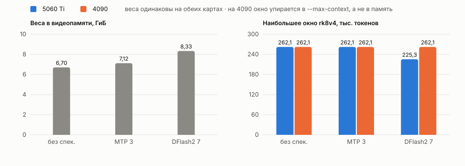
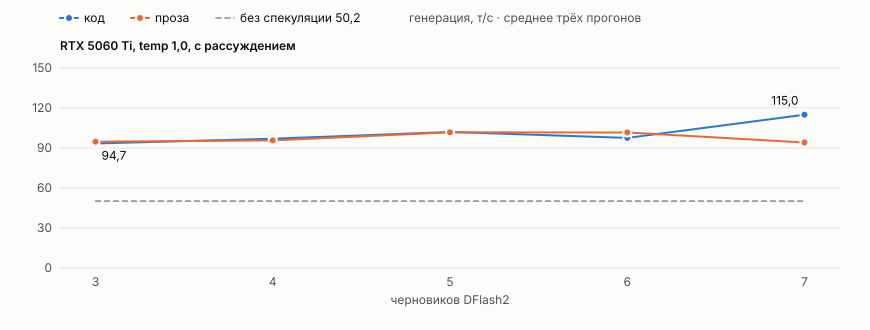
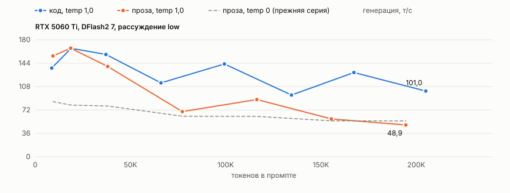
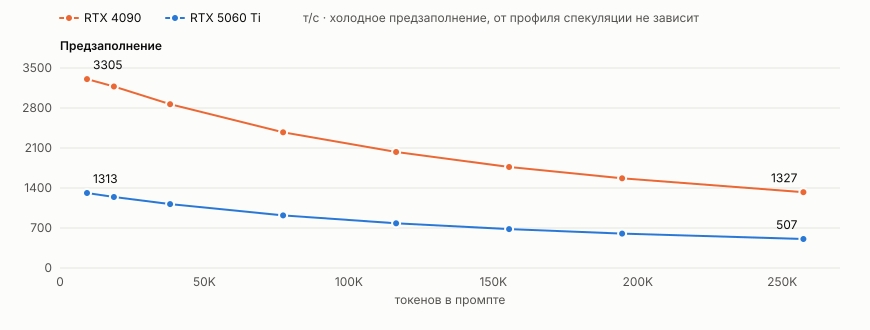
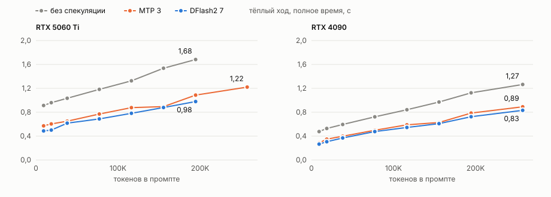
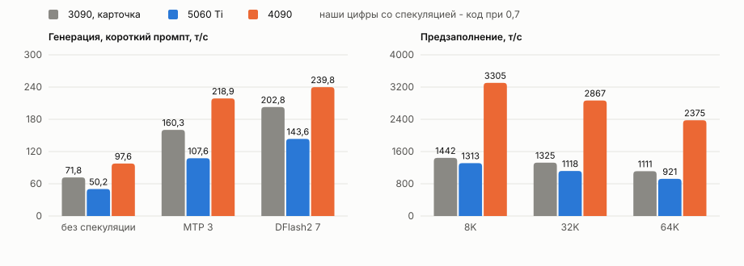

# Ternary Bonsai 2 27B на RTX 5060 Ti и RTX 4090

Замеры артефакта `WaveCut/Ternary-Bonsai-2-27B-NInfer-v3` на ветке `franken/v0.11`
(`ef976023`) плюс два коммита этой ветки. Один запрос за раз. Сэмплинг у серий разный,
и от него скорость спекуляции зависит напрямую:

- перебор черновиков и сравнение с карточкой - умолчания движка без рассуждения, temp 0,7,
  top_p 0,80, top_k 20;
- серия по глубине - жадное декодирование, `temperature 0`;
- отдельные серии на 5060 Ti - рабочий режим, temp 1,0 с рассуждением (разделы
  "При температуре 1,0" и "По глубине при температуре 1,0").

Это не прогон по [методике](methodology.md): корпус `run_serve_corpus.py` здесь не
запускался. Свои промпты, по одному замеру на точку, генерация считается как
`completion_tokens / decode_seconds` без вычета первого токена, приём черновиков -
доля принятых по журналу запросов. С таблицами моделей в этом каталоге цифры
напрямую не сравнить.

| | RTX 5060 Ti 16 ГБ | RTX 4090 24 ГБ |
|---|---|---|
| Compute capability, SM | 12.0, 36 | 8.9, 128 |
| Сборка | `CMAKE_CUDA_ARCHITECTURES=120a`, путь совместимости | `CMAKE_CUDA_ARCHITECTURES=89` |
| Драйвер | 595.91.07 | 595.91.07 |
| KV | `rk8v4`, `--kv-capacity auto` | то же |
| Достигнутое окно | 262144 (без спекуляции, MTP); 225280 (DFlash2) | 262144 во всех профилях |

## Что пришлось править под sm_120

1. **GDN gating: кооперативная сетка не помещается на 36 SM.** Таблицы маршрутов
   рассчитаны минимум на 82 SM (`kMinSupportedSmCount`). На 5060 Ti табличный split-k
   превышает бюджет резидентных CTA, и первое же предзаполнение падает с
   `cudaErrorCooperativeLaunchTooLarge`. Исправление: `fitted_schedule` спускается по
   лестнице split-k (32, 16, 8, 4, 2, без split), пока сетка не станет резидентной;
   слитый маршрут split32 для norm получил ту же проверку; размер workspace считается по
   неснижённому split-k, поэтому покрывает любой подобранный план. На картах от 82 SM
   планы не меняются. Коммит `f03810a`.
2. **Допуск 120a.** Сборка и рантайм принимают capability 12.0 на пути совместимости
   mma.sync. У потребительского Blackwell нет tcgen05 и тензорной памяти, mma.sync,
   ldmatrix и cp.async нативные, shared memory на SM те же 100 КиБ. Только этот путь
   переводит T2G128 на int8-предзаполнение. `NINFER_SM120_NATIVE=ON` оставляет
   возможность собрать блоки Blackwell FP8/NVFP4. Настройки занятости и split-k взяты
   от sm_86, то есть карта работает корректно, но под неё не подстроена. Коммит `a8b7d56`.

Корректность вывода проверялась иголкой в стоге: на обеих картах, во всех профилях и
на всех глубинах ниже она найдена.

## Как собирали

Контейнер `nvidia/cuda:13.1.2-devel-ubuntu22.04`: та же CUDA, что у проекта, и та же
glibc 2.35, что на хосте. Бинарь из контейнера запускается на хосте без контейнера.
В 22.04 не хватает трёх вещей, их доставляли сами:

- gcc-13 из `ppa:ubuntu-toolchain-r/test`, CMake 3.31.6 с Kitware;
- FFmpeg 7.1.1 в `/opt/ff7`: `--enable-shared --disable-autodetect --enable-zlib`.
  Без `--enable-zlib` при `--disable-autodetect` не собираются декодеры png/apng, и
  движок на PNG отвечает "media codec is not supported" (JPEG при этом работает);
- curl 8.11.1 в `/opt/curl8`: в 22.04 libcurl 7.81, а сборка требует 7.85 и выше, и
  медиа-загрузку вместе с приложениями не отключить.

```sh
cmake -S . -B build-sm120a -G Ninja -DCMAKE_BUILD_TYPE=Release \
    -DCMAKE_C_COMPILER=gcc-13 -DCMAKE_CXX_COMPILER=g++-13 \
    -DCMAKE_CUDA_HOST_COMPILER=g++-13 \
    -DCMAKE_CUDA_ARCHITECTURES=120a -DNINFER_BUILD_APPS=ON \
    -DBUILD_TESTING=OFF -DNINFER_BUILD_BENCHMARKS=OFF
cmake --build build-sm120a --target ninfer ninfer-serve
```

Для 4090 то же с `CMAKE_CUDA_ARCHITECTURES=89`. Рядом с бинарями в `lib/` кладутся
библиотеки FFmpeg 7, libcurl 8 и `libcudart`, `libcublas`, `libcublasLt` из CUDA: эта
ветка тянет cuBLAS динамически. При запуске `lib/` ставится первым в `LD_LIBRARY_PATH`.

## Как запускали

Сборка привязана к архитектуре: sm_120a не стартует на 4090, sm_89 не стартует на
5060 Ti. Когда карт в машине несколько, нужную выбирали по compute capability, а в
`CUDA_VISIBLE_DEVICES` отдавали её UUID при `CUDA_DEVICE_ORDER=PCI_BUS_ID`. Индекс
зависит от порядка нумерации CUDA, UUID от него не зависит.

```sh
ninfer-serve Ternary-Bonsai-2-27B-ninfer-v3.ninfer --device 0 \
    --spec dflash2 --draft-tokens 7 \
    --max-context 262144 --kv-capacity auto --kv-dtype rk8v4 --gdn-state-fp16 \
    --max-concurrency 1 --prefill-chunk 1024 --preserve-thinking
```

`--spec mtp --draft-tokens 3` для MTP; без `--spec` - без спекуляции. Зрение в замерах
выключено.

- `--kv-capacity auto` оставляет 1024 МиБ запаса и никогда не превышает
  `--max-context`: на лёгких профилях окно определяет `--max-context`, а не память.
- `rk4v4-e8` эта ветка не знает. Из KV-кодеков брали `rk8v4`.
- Если нужно полное окно с DFlash2 на 16 ГБ, остаётся `nvfp4` KV: он вдвое дешевле.
  Этот вариант не мерили.
- Умолчания сэмплинга движка: в режиме рассуждения temp 1,0, top_k 20, top_p 0,95; без
  рассуждения 0,7 / 20 / 0,80 и presence_penalty 1,5. `--temperature` задаёт
  температуру для обоих режимов, поле `temperature` в запросе важнее ключа.

## Память

| профиль | веса в видеопамяти | наибольшее окно `rk8v4`, 5060 Ti | свободно при 262144, 4090 |
|---|---:|---:|---:|
| без спекуляции | 6,70 ГиБ | 262144 | 9,71 ГиБ |
| MTP 3 | 7,12 ГиБ | 262144 | 8,88 ГиБ |
| DFlash2 7 | 8,33 ГиБ | 225280 (ёмкость числом), 204800 (`auto`) | 7,90 ГиБ |



Токен `rk8v4` стоит 26112 байт, окно 262144 - 6,375 ГиБ под KV.

С DFlash2 на 5060 Ti `--kv-capacity auto` не спасает от слишком большого
`--max-context`. При 262144 сервер не стартует: "minimum Engine runtime reservation
requires 7835557120 bytes in addition to 1073741824 bytes of automatic headroom, but
only 7515275264 bytes are available after weights". Ёмкость под память подбирается,
а минимальный резерв считается от запрошенного окна. При `--max-context 204800`
занято 3200 страниц из 3200, свободно 1,52 ГиБ, из них 1 ГиБ - запас режима `auto`.
Возможно, здесь стоит ужимать окно до влезающего, а не падать.

Явная ёмкость запаса не держит. `--max-context 225280 --kv-capacity 225280`
стартует со свободными 1,02 ГиБ. Под промптом на 214885 токенов работает без сбоев:
предзаполнение 564,5 т/с, генерация 44,4 т/с.

## Сколько черновиков давать DFlash2

Генерация 900 токенов, т/с. Промпт прозы 92 токена, промпт кода 120. "Токенов на шаг" -
число сгенерированных токенов, делённое на число раундов проверки, как в карточке
модели. Без спекуляции 5060 Ti даёт 50,2 т/с, 4090 - 97,5-97,6.


| черновиков | 5060 Ti проза | 5060 Ti код | 4090 проза | 4090 код |
|---:|---:|---:|---:|---:|
| 3 | 71,2 | 114,1 | 136,3 | 225,6 |
| 4 | 71,5 | 121,7 | 125,6 | 250,5 |
| 5 | 65,5 | 128,3 | 130,9 | 236,8 |
| 6 | 66,4 | 141,6 | 128,6 | 243,0 |
| 7 | 66,3 | 143,6 | 130,0 | 239,8 |
| 8 | 48,1 | 101,1 | 96,2 | 205,4 |
| 9 | 46,3 | 105,7 | 95,5 | 200,3 |
| 12 | 45,0 | 104,2 | | |

- **Между 7 и 8 черновиками обрыв на обеих картах**: на 5060 Ti около -30%, на 4090
  от -14 до -26%. Число токенов на шаг при этом почти не меняется: код на 5060 Ti даёт
  3,96 на семи и 3,77 на восьми. Семь черновиков плюс один настоящий - восемь токенов на
  раунд проверки. Похоже, раунд из девяти уходит с быстрого пути.
- **На прозе число токенов на шаг упирается в 1,8-1,9** при любом числе черновиков,
  там лучше всего 3-4. На коде растёт до семи.
- На 4090 значения от 4 до 7 расходятся в пределах 3%, это шум одиночного прогона.
  Если нужно одно значение на обе карты, подходит 6: от лучшего среднего кода и прозы
  оно отстаёт меньше чем на 1%.
- **Токенов на шаг заметно меньше, чем 5,0 в карточке** (ответы GSM8K, DFlash2 7):
  3,5-4,0 на нашем промпте кода и 1,8-1,9 на прозе. MTP 3 даёт на коде 2,9-3,0, близко к
  3,2 из карточки.

## При температуре 1,0

Только 5060 Ti и только DFlash2. Температура 1,0, рассуждение включено, top_p 0,95 и
top_k 20 от движка, 900 токенов. Каждая точка - среднее трёх прогонов с разным seed: при
1,0 текст от прогона к прогону разный. В скобках разброс между прогонами.



| черновиков | проза, т/с | ток/шаг | код, т/с | ток/шаг |
|---:|---:|---:|---:|---:|
| без спекуляции | 50,2 | 1 | 50,2 | 1 |
| 3 | 94,7 (80,8-103,4) | 2,44 | 93,4 (92,4-94,1) | 2,41 |
| 4 | 95,7 (83,7-116,4) | 2,51 | 97,0 (94,8-100,6) | 2,55 |
| 5 | 101,8 (82,3-117,1) | 2,75 | 102,0 (91,4-114,1) | 2,74 |
| 6 | 101,6 (88,3-119,1) | 2,77 | 97,6 (91,0-107,0) | 2,67 |
| 7 | 94,1 (90,2-98,8) | 2,61 | 115,0 (112,2-120,2) | 3,18 |

- **Спекуляция при 1,0 окупается**: около двух раз к генерации без неё.
- **Семь черновиков остаются лучшими в среднем**, выигрыш дают они на коде. Между 5, 6 и
  7 разница сравнима с разбросом прогонов.
- **Код на семи черновиках - 115 т/с против 143,6 при 0,7 без рассуждения**, на 20%
  меньше, токенов на шаг 3,18 против 3,96. Промпт тот же, но ответ другой: при 1,0 с
  рассуждением модель сначала пишет ход мысли, потом код.
- **Прозу с таблицами выше напрямую не сравнить.** С рассуждением модель сначала пишет
  ход мысли, и его черновик угадывает лучше, чем готовый текст: 94 т/с против 66.

## По глубине при температуре 1,0

Только 5060 Ti, DFlash2 7, `--max-context 225280 --kv-capacity 225280`. Температура
1,0, рассуждение включено, `reasoning_effort: low`, потолок вывода 8000 токенов. Промпт
с иголкой в стоге, после него задание:

- код - исходники Python и shell нашей обвязки для замеров, затем класс `LRUCache` на `OrderedDict` с
  подсказками типов и пятью тестами pytest;
- проза - связный текст, затем около 300 слов об истории мостостроения.

Холодное предзаполнение, у каждого промпта своя соль. Каждая точка - один запрос.
Все ответы закончились естественной остановкой, иголка найдена везде, в ответах на
задание с кодом код есть.



Код:

| токенов в промпте | предзаполнение, т/с | генерация, т/с | приём | токенов в ответе |
|---:|---:|---:|---:|---:|
| 8694 | 1273 | 136,5 | 43% | 3551 |
| 18856 | 1216 | 166,9 | 58% | 1087 |
| 37135 | 1108 | 157,4 | 59% | 725 |
| 66040 | 960 | 113,7 | 43% | 3820 |
| 99312 | 829 | 142,8 | 64% | 887 |
| 134536 | 726 | 94,9 | 42% | 2981 |
| 167282 | 651 | 129,6 | 68% | 1637 |
| 205058 | 580 | 101,0 | 55% | 1884 |

Проза:

| токенов в промпте | предзаполнение, т/с | генерация, т/с | приём | токенов в ответе |
|---:|---:|---:|---:|---:|
| 9334 | 1290 | 155,1 | 51% | 3175 |
| 18660 | 1228 | 167,0 | 59% | 4939 |
| 38105 | 1105 | 138,9 | 51% | 3866 |
| 77221 | 912 | 69,5 | 22% | 550 |
| 116338 | 776 | 88,0 | 36% | 2181 |
| 155455 | 676 | 58,2 | 22% | 1051 |
| 194548 | 598 | 48,9 | 19% | 637 |

- **Предзаполнение то же, что в серии при `temperature 0`**: 1273-1290 т/с на 9K и
  580-598 т/с у 200K. От сэмплинга оно не зависит.
- **Код держит 95-167 т/с на всей глубине**, на 205K - 101 т/с. Разброс между
  соседними точками определяется приёмом черновиков (42-68%), а приём - тем, как модель
  на этот раз распределила ответ между ходом мысли и кодом.
- **Проза с глубиной падает сильнее**: 139-167 т/с до 38K, дальше 49-88 т/с, приём
  опускается до 19-22%. На длинном контексте проза по тексту угадывается черновиком
  плохо, как и в серии при `temperature 0`.
- При 1,0 и одном запросе на точку соседние точки расходятся на 20-40 т/с. Кривая
  показывает уровень, а не форму зависимости.
- Проза на 192K по цели не поместилась: тот же объём текста даёт около 233K токенов
  при окне 225280, сервер ответил 400.

## По глубине

Промпт с иголкой в стоге, 500 сгенерированных токенов после холодного предзаполнения,
затем короткий тёплый ход. `temperature 0`. Первая точка - уже 9345 токенов, а ответ
прозаический, поэтому генерация здесь ниже, чем на коротком коде в таблицах выше.


Предзаполнение от профиля спекуляции не зависит (совпадение в пределах 1% на каждой
глубине), поэтому на карту одна колонка:



| токенов в промпте | 5060 Ti, т/с | 4090, т/с |
|---:|---:|---:|
| 9345 | 1313 | 3305 |
| 18671 | 1243 | 3177 |
| 38116 | 1118 | 2867 |
| 77232 | 921 | 2375 |
| 116349 | 783 | 2030 |
| 155466 | 680 | 1767 |
| 194559 | 602 | 1569 |
| 257342 | 507 (MTP) | 1327 |

Генерация, т/с. Промпт похож на прозу, поэтому DFlash2 принимает около 20% черновиков,
MTP около 37%.

| токенов в промпте | 5060 Ti без спек. | 5060 Ti MTP 3 | 5060 Ti DFlash2 7 | 4090 без спек. | 4090 MTP 3 | 4090 DFlash2 7 |
|---:|---:|---:|---:|---:|---:|---:|
| 9345 | 48,4 | 74,7 | 84,8 | 94,2 | 149,3 | 158,6 |
| 18671 | 46,9 | 72,8 | 79,5 | 91,5 | 150,2 | 151,2 |
| 38116 | 44,3 | 70,0 | 78,1 | 84,6 | 133,9 | 134,0 |
| 77232 | 39,9 | 61,6 | 62,4 | 75,9 | 121,6 | 143,1 |
| 116349 | 36,4 | 58,1 | 62,1 | 69,0 | 110,7 | 122,4 |
| 155466 | 33,3 | 53,1 | 55,2 | 63,2 | 99,5 | 105,0 |
| 194559 | 30,8 | 46,7 | 55,2 | 58,3 | 96,2 | 98,5 |
| 257342 | | 44,2 | | 52,0 | 84,3 | 97,5 |

Тёплый ход - короткое продолжение того же разговора (около 75 новых токенов), полное
время в секундах. С глубиной оно растёт почти линейно: от самой мелкой точки до самой глубокой в 1,8-3
раза. В таблице -
от мелкой глубины к глубокой:



| | без спекуляции | MTP 3 | DFlash2 7 |
|---|---|---|---|
| 5060 Ti | 0,91-1,68 | 0,57-1,22 | 0,49-0,98 |
| 4090 | 0,48-1,27 | 0,29-0,89 | 0,27-0,83 |

## Рядом с карточкой модели (RTX 3090)



| | 3090 (карточка) | 5060 Ti | 4090 |
|---|---:|---:|---:|
| без спекуляции, короткий | 71,8 | 50,2 | 97,6 |
| MTP 3, короткий | 160,3 | 73,2 проза / 107,6 код | 138,3 проза / 218,9 код |
| DFlash2 7, короткий | 202,8 | 66,3 проза / 143,6 код | 130,0 проза / 239,8 код |
| предзаполнение 8K / 32K / 64K | 1442 / 1325 / 1111 | 1313 / 1118 / 921 | 3305 / 2867 / 2375 |

Промпты разные. В карточке - короткий чат и ответы на задачи GSM8K (набор школьных
текстовых задач по арифметике). Решение там идёт шаблонными шагами, черновик его
угадывает легко: 5,0 токена на шаг против 3,5-4,0 на нашем коде и 1,8-1,9 на
прозе. Поэтому строки со спекуляцией сравнивают задачи, а не карты, и считать их
разницу разницей железа нельзя. Генерация без спекуляции и предзаполнение от
содержимого промпта почти не зависят, их сравнивать можно.
