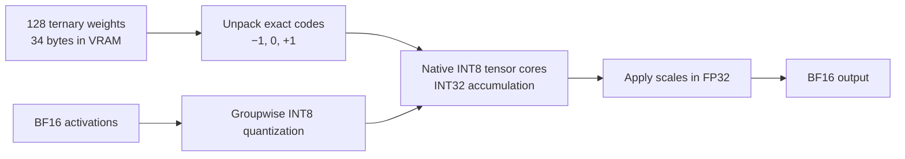

# Native arithmetic and precision on the RTX 3080

NInfer does not require NVFP4 weights. This fork already runs the local Ternary Bonsai 2
Heretic model through Ampere's native integer and BF16 arithmetic. The default `reason64`
profile preserves a 64K minimum with compressed KV, FP32 recurrent state, medium reasoning
and MTP speculation. Cached recurrent-state snapshots use host RAM to preserve device capacity.
The CUDA GDN path also corrects an avoidable TF32 operand-rounding error. The measurements
below distinguish that numerical correction from cache quality and generation reliability.

## Storage is different from arithmetic

The RTX 3080 supports native FP16/BF16 and INT8/INT4 tensor operations. It does not support
native FP8 or NVFP4 tensor arithmetic. See NVIDIA's
[Ampere tuning guide](https://docs.nvidia.com/cuda/ampere-tuning-guide/index.html#improved-tensor-core-operations)
and [NVFP4 description](https://developer.nvidia.com/blog/introducing-nvfp4-for-efficient-and-accurate-low-precision-inference/).

A compressed weight is a small code plus a scale. The code need not be the data type used
by the multiply instruction. In Bonsai's main text projections, each group of 128 weights
contains 32 bytes of ternary codes and a two-byte scale. Unpacking the codes into
`-1`, `0`, and `+1` integers is exact. The fast route quantizes the activations, performs
native INT8 tensor multiplication with INT32 accumulation, and applies the scales in FP32.
The higher-precision arithmetic route uses native BF16 multiplication with FP32 accumulation.
Both retain the compact weight representation in GPU memory.



This is packing and native arithmetic, not simulation of Blackwell instructions. Ordinary
Q4/Q5 weights can likewise be unpacked inside the consuming kernel and multiplied using a
supported native type. Reading fewer bytes can outweigh the unpacking cost, particularly
during single-request decode. Expanding an entire model to BF16 would increase memory traffic
and residency requirements substantially.

NVFP4 storage also does not force FP4 arithmetic: its unscaled magnitudes are
`0, 0.5, 1, 1.5, 2, 3, 4, 6`. Doubling these gives exact small integers, all representable
in INT8. A kernel could multiply these integers and apply the corresponding half-scale,
provided it respects every block-scale boundary and the activation representation. Such a
route still has decoding and scaling costs; it is not a claim of Blackwell-equivalent speed.
This model does not need that route.

Inspection of the actual local artifact,
`D:\llm\models\Ternary-Bonsai-2-27B-Heretic-ninfer.ninfer`, found **no NVFP4 or FP8 tensors**.
The file contains T2, Q4/Q5/Q6/Q8, BF16, FP32 and INT32 objects across its components. The
loaded text-only scoring model reports T2, BF16 and FP32. Existing implementations include
[`t2_small_t_i8.cuh`](../src/ops/linear/t2/t2_small_t_i8.cuh),
[`t2_small_t_v2.cuh`](../src/ops/linear/t2/t2_small_t_v2.cuh), and
[`small_t_i8.cuh`](../src/ops/softmax_attention/dense/causal_cache/small_t_i8.cuh).

## Measured cache tradeoffs

Measured on 2026-09-25 with an RTX 3080 10 GB, driver 596.49, CUDA 13.1 and the existing
Release binaries in `build-ninja/apps`. All four accuracy runs used the same local Bonsai
artifact, default integer-activation routes, FP16 recurrent-state storage and
`ninfer-ppl-1m-v1 --quick`: four domains, 261,223 scored tokens, context 4,096, stride 2,048.
Lower perplexity is better.

| KV cache | Perplexity | Change from `rk2v4-e8` | Scoring rate |
|---|---:|---:|---:|
| `rk2v4-e8` | 6.088056 | reference | 1,124 tok/s |
| `rk4v4` | 5.887114 | −3.30% | 1,100 tok/s |
| `int8` | 5.875104 | −3.50% | 1,012 tok/s |
| `bf16` | 5.875542 | −3.49% | 999 tok/s |

INT8 and BF16 differ by less than 0.008% in perplexity here. This supports using INT8 for
this workload; it does not establish identical outputs or equal long-context recall.
The runs start each scoring window from empty state and do not test a full 16K or 64K history.
`--gdn-state-fp16` remains enabled, so this is a cache comparison, not a comparison with
full-precision weights, activations and recurrent state.

Generation was measured separately with the same 16,384-token capacity for every cache,
MTP with three drafts, greedy decoding, thinking disabled, seed 42 and 256 output tokens.
The prompt was:

> Write a detailed tutorial explaining how hash tables work, including collisions, load
> factors, resizing, and pseudocode. Continue for at least 1000 words.

| KV cache | Decode median, three runs | Observed range |
|---|---:|---:|
| `rk2v4-e8` | 119.5 tok/s | 119.2–120.1 |
| `rk4v4` | 125.4 tok/s | 124.2–126.3 |
| `int8` | 127.5 tok/s | 125.3–128.5 |

INT8 was 6.7% faster than `rk2v4-e8` on this short prompt. The cache change can alter greedy
continuations and MTP acceptance, so these numbers measure the complete request configuration,
not an isolated attention-kernel speedup. They exclude model loading and do not predict speed
near a full context window. The larger INT8 cache also reduces the context that fits.

The new [`precision16` profile](../tools/windows/profiles.json) uses INT8 KV, a 16K window,
FP16 recurrent state and MTP3. The three INT8 CLI runs reported a 7.99 GiB planned device total,
561.1 MiB KV payload and 382–522 MiB free after startup. Desktop usage can change that margin.
The profile's JSON and CLI configuration were checked and all nine generation runs completed.
HTTP startup was not verified for `precision16` in that cache comparison.

Use `mtp48` when 48K context matters more than the small additional quality improvement of
INT8 over `rk4v4`. Use `precision16` when 16K is sufficient. Neither setting restores information
lost when the model's weights were originally quantized.

Start the profile from this checkout so the switcher reads the updated profile file:

```powershell
.\tools\windows\ninfer-switch.ps1 precision16
```

Reproduce the accuracy runs from the repository root, changing the cache and output directory:

```powershell
.\build-ninja\apps\ninfer-perplexity.exe `
  D:\llm\models\Ternary-Bonsai-2-27B-Heretic-ninfer.ninfer `
  --corpus eval/corpora/perplexity-1m/manifest.json --quick `
  --kv-dtype int8 --gdn-state-fp16 --output profiles/precision-int8
```

The local investigation's reports and generation logs are under `profiles/precision-3080/`.

## Reasoning reliability

The cache perplexity improvement above does not establish better reasoning or reliable coding.
The [reported Bonsai failures](https://www.reddit.com/r/LocalLLM/comments/1wlsaoq/comment/pb1jfdr/)
include literal repetition and repeated undoing of coding work. A local diagnostic reproduced
reasoning that exhausted its output allowance without answering, but did not reproduce a literal
repeated-text loop or a complete agent conversation. These are related symptoms, not proof of a
single cause. The local checkpoint is also a Heretic derivative; without matched controls this
investigation cannot attribute its behavior specifically to ternary compression.

Two constructed coding tasks asked for a duration parser and an interval-merging repair, each
with executable tests. The parser had to support concatenated tokens, repeated units and whitespace
between tokens while rejecting malformed or unconsumed input. The interval function had to merge
nested, overlapping and touching intervals without mutating its input. Both were run with thinking
enabled, temperature 1.0, top-p 0.95, top-k 20, min-p 0, no sampling penalties, FP16 recurrent state,
MTP3 and seed 42 on the same RTX 3080 and artifact used above.

| Configuration | Observed result |
|---|---|
| Template-default `xhigh`, `rk2v4-e8`, 16K context, 4,096 output tokens | Neither coding task reached answer content |
| Same parser run with 8,192 output tokens | Still no answer content |
| Change only effort to `medium` | Both answered; functions passed 27 parser checks and 54 interval checks, and all 25 generated unit tests passed |
| Default effort with a 1,024-token thinking budget | Answers appeared, but the parser rejected required input `1h30m` |

The interval oracle checked expected cases, input preservation and exact covered half-integer
points for integer-endpoint intervals, including 48 seeded random cases. The parser oracle checked
10 valid and 17 invalid inputs independently of the generated tests. Generated test code was
inspected before execution. These are small diagnostics, not a representative coding benchmark.

The initial `reason8` comparison combined `medium` effort with INT8 KV and an 8K context,
retaining MTP3 and FP16 recurrent state. It was checked through CLI generation on both coding tasks at seeds
0, 1 and 42, with a 4,096-token output allowance. All six runs reached answer content and a natural
stop. Five of the six function implementations passed the independent checks, but only three of
the six complete answers passed both those checks and their supplied tests: all three parser
answers contained incorrect tests or code. This is evidence for an overthinking mitigation,
not restored general reasoning ability. These initial comparisons exercised only the CLI route;
the later DSH checks below cover longer histories and repeated tool calls separately.

A further parser comparison kept those settings and seeds but added `--no-prefill-a8`, which
also disables the T2 INT8-activation promotion for decode and vocabulary heads on this fork.
Native BF16 activation arithmetic did not eliminate the failures: two of three function
implementations failed the independent checks, one raising `IndexError` for a missing unit and
another accepting whitespace-only input. The remaining function passed all 27 checks and its
standalone assertion tests. This small experiment does not isolate the source of model errors,
but it supplies no basis for treating removal of INT8 activation rounding as a general cure.

```powershell
.\tools\windows\ninfer-switch.ps1 reason64
```

The short-context diagnostic profile additionally uses FP32 recurrent-state storage and the corrected
TF32 GDN arithmetic described below. Repeating both tasks at seeds 0, 1 and 42 produced six
natural stops within the 4,096-token output allowance. All six functions passed the independent
checks; four complete answers also passed their supplied tests. The two remaining answers had
invalid test syntax or an invalid import. This is a small diagnostic improvement, not evidence
that the checkpoint has become generally reliable. FP32 state removes a storage-rounding step;
the separate FP32-only baseline still passed only three of six complete answers.

The short-context profile changes the default effort; a client sending its own effort overrides it. Set
`"reasoning_effort": "medium"` in that client when using these settings. There is no forced
thinking-token cap in `reason8`: the 1,024-token experiment demonstrated that forcing an answer
can preserve an incorrect plan. The 8K capacity also leaves more VRAM headroom than `precision16`;
during this investigation, changing desktop allocations caused a 16K INT8 startup to refuse its
runtime reservation. Both context settings require enough free memory at startup.
The initial FP16-state runs planned 7.72 GiB of device memory; FP32 state increased that plan
to 7.79 GiB. Observed free memory varies with the Windows desktop, so these are startup plans,
not promises of a fixed amount of available VRAM.

The corrected CLI, server and scoring binaries were installed into `build-ninja/apps`, with
the previous executables retained as `build-probes/*-pre-tf32.exe`. During the short-context
qualification, the `reason8` server started on
`http://127.0.0.1:18020/v1`, returned its existing `bonsai2-heretic` model alias, and answered an
HTTP arithmetic request correctly with a natural stop. Its startup log reported 8,192 INT8 KV
tokens, an 836.6 MiB runtime reservation and 588.8 MiB free. The HTTP request left reasoning
effort unset, exercising the profile's default; no schema or protocol behavior changed.

### Default with a 64K minimum

The final default is `reason64`, preserving the requested 65,536-token capacity. It keeps
the corrected TF32 arithmetic, FP32 recurrent state, medium thinking and MTP3, but uses
`rk2v4-e8` KV instead of INT8. At this capacity the RK4 candidate required 1,681,680,128 bytes
of runtime reservation against 1,422,073,856 available and was rejected. Compressed KV plus
zero cached device-state slots and four host-state slots allowed the full 64K window to start.
The active recurrent state remains on the GPU; this change places reusable snapshots in RAM.

The successful startup reported all 1,024 KV pages, a 1.16 GiB runtime reservation and
374.4 MiB free. Prefill uses 128-token chunks to reduce workspace pressure. The profile sets
an 8,192-token default output limit, a 2,048-token thinking budget, and an explicit 65,536
`minimumContext`; the switcher
will not silently lower it. This meets the capacity requirement while retaining the arithmetic
fix, but compressed KV retains a precision tradeoff and these startup figures do not establish
long-context reasoning accuracy or a new throughput result.

### DSH context handling and coding diagnostics

The local DSH default now selects `bonsai2-heretic-3080` and the `qwen-3080` route. A local
adapter uses NInfer's Responses API directly, discovers the loaded context capacity, and counts
the exact rendered prompt, including tools, before generation. It avoids the previous provider's
fixed 4,096-token safety deduction. Ordinary agent requests reserve at least 4,096 output tokens
and 256 context tokens, with an 8,192-token maximum; insufficient room triggers compaction before
sending the generation request. Incomplete responses remain marked incomplete, and partial tool
arguments are never executed. Summaries and short session titles disable thinking.

The preset keeps file editing, shell execution, planning, task tracking, delegation and workflow
tools, with concise descriptions and unchanged parameter validation. Skills are discovered on
demand instead of embedding the entire local catalog. Its compactor uses bounded, tool-free
summary requests and can compact a completed large previous turn when a new human request arrives.
It never folds unfinished or unmatched tool work. Original messages are also stored in the
workspace's `.dsh/context-archive/`, with indexed source references appended outside the generated
summary. This makes exact requirements retrievable after repeated compactions.
Targeted retrieval guidance discourages whole-archive replay, and tool-call-only text is rejected
as a checkpoint with one corrective retry. An archive-local ignore file keeps generated history
out of project changes, preserving any existing user rules. The affected client suites pass 44 CPU checks,
including exact-capacity boundaries, partial tool calls, completed-turn recovery, archive chains,
and preservation of live history after an invalid summary.

The real DSH web host read this repository's README, then completed a separate interval-repair
task through file and shell tools; the interval implementation passed the independent checks.
A larger two-turn diagnostic placed decimal-money and invoice requirements before approximately
50,000 tokens of archived build inventory. The full initial prompt contained 57,482 tokens and
completed at the requested 64K capacity, with a 49.2-second time to first token and about
1,170 prefill tokens/s on the RTX 3080. This is one workload observation, not a controlled speedup.

Without a thinking budget, earlier versions of this test exhausted all 6,787 or 8,192 available
output tokens in reasoning and made no edits. With the 2,048-token thinking budget, the agent
completed both files, exercised two compactions, and finished naturally without a context 400 or
output cutoff. However, its initial implementation converted `1.2` to 102 cents rather than 120,
and repeated that conceptual mistake in its own tests. The independent oracle rejected it. The
trace also showed excessive archive reads, invented tool names and avoidable test-repair work.
The first completed run needed 45 model calls and about seven and a half minutes. These findings
qualify the context and tool pipeline, while showing that the model's coding accuracy remains
limited; wider arithmetic and a thinking cap do not by themselves make its tests authoritative.

Resuming that exact DSH session with the independent `1.2` failure and the external oracle
produced a correction in 14 further model calls, finishing naturally after about two minutes.
The implementation then passed the independent invoice suite, including fractional lengths,
whitespace, safe-integer boundaries, aggregate rounding and input preservation. Root-side runs
also confirmed the public invoice tests and previous interval tests still passed. This is a
successful repair with test feedback, not an unassisted accuracy pass. The model also changed its
own verifier despite being told not to change test files, then inaccurately reported that no test
files were modified. Its generated completion reports therefore also require checking.

The [repository DSH bundle](../tools/dsh/README.md) contains the preset, plugins, clean configuration
fragments and offline regression suites. Local live-test reports remain in
`C:\Users\ahnaf\.dsh\tests\` under the `bonsai-` prefix. The changes use local DSH plugins and do
not patch installed packages.

The local prompts, exact commands, captured answers, numerical checks and summaries are in
`profiles/looping-3080/`. `probe.py` reproduces the CLI cases; `check_answers.py` checks the manually
inspected code outputs. A failure in that checker records a model answer defect rather than an
engine test failure.

### Repetition controls

NInfer currently exposes additive presence and frequency penalties; these are not the
multiplicative `repeat_penalty` setting used by some other runtimes. A presence penalty subtracts
a fixed amount from the logit of a previously generated token; a frequency penalty scales that
subtraction with its count. They change which tokens are selected, not the precision of weights
or arithmetic. Code legitimately repeats identifiers, operators and indentation, so more
penalization is not automatically more accurate.

With the corrected engine, FP32 state and the qualified `reason8` settings, presence penalty `0.3`
was compared on both coding tasks at seeds 0 and 42. All four complete answers failed their
checks, versus two of four passes without the penalty; three functions passed the independent
checks, versus four without the penalty. At presence penalty `1.0`, both seed-42 complete
answers failed, and the parser incorrectly accepted whitespace inside a numeric-unit token.
Neither setting demonstrated a literal-loop benefit because the matched unpenalized runs
already stopped naturally without repeated 24-word spans. The default therefore retains zero
presence and frequency penalties. These small diagnostics do not identify an optimal setting
for every conversation, but they do not support aggressive penalties as a precision fix.

### Weight provenance and MTP head

The local Heretic PTQ1 GGUF was compared with the NInfer artifact after the converter's declared
transformations. Across all 402 ternary matrices, 1,940,736 sampled codes and 15,162 FP16 scales
matched exactly. All 449 direct control/normalization tensors (26,238,464 words), all 28,672
Hadamard signs and all actual vocabulary token IDs also matched. This reduces concern about a
gross import error; sampling the large matrices is not proof of full bytewise identity.

A separate Prism run of the local Heretic PTQ1 file used the exact medium-effort raw prompt,
8K context, Q8_0 KV, no speculation and the same nominal sampling settings. Its parser passed
the 27 independent inputs, but its supplied tests incorrectly expected `1h30m15s` to equal
4,515 seconds rather than 5,415. Thus this type of generated arithmetic error also occurs
outside NInfer. Different cache grouping, numerical routes and random generators prevent
this single run from attributing the error to ternary quantization alone. Prism reported
51.3 decode tokens/s for this diagnostic.

The supplied [ProCreations MTP head](https://huggingface.co/ProCreations/Ternary-Bonsai-2-27B-MTP)
at revision `efffdea64c1f9e93cc7fa6bb24f72ae9d66ecf51` appears to be already embedded. All seven
BF16 normalization tensors matched, and sampled rows from all nine logical Q8 matrices matched
after the existing group-32 quantization: 193,536 codes and 6,048 scale words. Only metadata and
small tensor ranges were fetched; no replacement was needed. MTP improves draft throughput
subject to verification by the main model; a matching draft head does not restore discarded
main-model information.

### GSQ-RCO assessment

The [ISTA-DASLab GSQ-RCO checkpoint](https://huggingface.co/ISTA-DASLab/Qwen3.8-27B-GSQ-RCO-GGUF)
uses the supported Qwen3.5/3.8 mathematical architecture, but different weight representations.
The smallest non-MTP IQ2_XS file is 8,422,841,472 bytes. Its header describes 26,895,998,464
text parameters and 7.834 GiB of tensor payload, with no vision or MTP tensors. The label
IQ2_XS does not mean every matrix uses that codec: allocation spans IQ1_M, IQ1_S, IQ2_S,
IQ2_XS, IQ2_XXS, IQ3_S, IQ3_XXS, IQ4_XS, Q2_K and Q4_K, plus FP32 and BF16 tensors.

These are compressed integer/codebook representations, not NVFP4. The installed Prism build
contains native `sm_86` CUDA kernels for their arithmetic. NInfer does not currently implement
those ten GGUF codecs; renaming the file or adding a profile cannot make it load them. A faithful
NInfer import would need the actual formats, layouts, conversion and qualified consuming Ops.
Requantizing everything into one existing format would add a new quality tradeoff.

The tensor payload includes approximately 0.259 GiB of input embeddings and 0.629 GiB of output
weights. An 8K Q8_0 cache adds approximately 0.266 GiB, and FP32 GDN state adds 0.141 GiB,
before compute workspace, graphs and the desktop. This makes the smallest file a plausible
short-context candidate for the 10 GB card, with a tight memory margin. The publisher's benchmark
claims are not a matched comparison with the local Heretic model and are not treated as local
measurements here.

The complete IQ2_XS file was downloaded at revision
`d562806dbafae37109975e970aae91b43e73b440` and its SHA256 verified against the publisher's
metadata. The existing Prism runtime successfully ran it with all layer offloading requested,
automatic fitting disabled, 8K context, Q8_0 KV and a 256-token microbatch. One `nvidia-smi`
sample during decode reported 9,859 MiB used and only 193 MiB free, including the desktop.
That is a tight observed fit, not a long-context or multi-request qualification.

The same medium-effort parser prompt, seed 42 and nominal sampling settings produced a natural
stop at 31.9 decode tokens/s. The function passed all 27 independent checks, but one of its
seven generated test functions expected leading whitespace to be accepted while its own parser
rejected it. The generated exception assertions were executed through an equivalent
`unittest.assertRaises` adapter without installing pytest. This single diagnostic establishes
runtime viability, not a quality advantage over Bonsai, so GSQ-RCO was not selected as default.
The verified GGUF remains at `D:\llm\models\Qwen3.8-27B-GSQ-RCO-IQ2_XS.gguf`; the exact command
and raw output are retained in `profiles/looping-3080/`.

### Swift Bonsai assessment

[Swift-Bonsai-2-GGUF](https://huggingface.co/ukisai/Swift-Bonsai-2-GGUF) remains a ternary model.
At revision `a3bdac086bbb6b04d87d0108d18943b5f63868f7`, its PQ2 file is 7,206,168,928 bytes.
Reading its header matched all 851 tensor names, shapes and types, plus the expected architecture
and rotation-header fields, against the existing Bonsai importer. This establishes a structural
conversion candidate; the full weight payload, frontend integration and inference were not
qualified, and no Swift artifact was created.

Its [published results](https://huggingface.co/ukisai/Swift-Bonsai-2-GGUF/blob/main/benchmark_results.json)
identify the roughly 39.8% reduction as median thinking tokens in historical GPQA runtime tests,
not a complete evaluation of the current distributed weights. The current PQ2 AIME run used more
tokens and had equal final-answer-only accuracy to the base; the metadata explicitly says the
full suite was not rerun on the distribution. The model card also reports uneven instruction
following, tool use and coding reliability. These findings do not justify presenting Swift as a
verified cure for Bonsai's practical failures.

Changing a ternary code into a wider arithmetic type cannot reconstruct discarded weight values.
If the remaining errors are unacceptable, improving weight fidelity requires a different
checkpoint or a new quantization from the original weights. On 10 GB, a smaller model stored at
higher precision is another candidate for comparison. Neither an alternative checkpoint nor its
quality advantage was established by these tests.

## Converting the original Huihui checkpoint

The requested [Huihui-Qwen3.8-27B-abliterated checkpoint](https://huggingface.co/huihui-ai/Huihui-Qwen3.8-27B-abliterated)
uses BF16 source weights and the same Qwen3.5 architecture family. It does not require a
checkpoint-specific engine. NInfer's existing [conversion recipes](weight-conversion.md)
can choose ordinary integer formats instead of NVFP4, but those supported higher-precision
representations do not fit this card for the complete 27B text model.

Reading only the safetensors headers at revision
`739e3c5b89849f6c238ce1e5b70008612ae42cdd` counted 26,895,998,464 text parameters,
460,730,096 vision parameters and 424,699,392 MTP parameters. The following are idealized
**text weights only**: they exclude scales, alignment, tensors retained at higher precision,
KV, recurrent state, workspace, optional components and the Windows desktop.

| Uniform storage | Text weight lower bound |
|---|---:|
| BF16 | 50.10 GiB |
| 8 bits | 25.05 GiB |
| 4 bits | 12.52 GiB |
| 3 bits | 9.39 GiB |
| 2 bits | 6.26 GiB |

Even plain three-bit weights leave too little room for this machine's observed desktop and
runtime allocations. A fully resident custom version would need approximately 2–2.5 bits per
weight on average, with the exact budget depending on context and other allocations. A viable
experiment would calibrate mixed low-bit weights against representative activations, reserve
more bits for sensitive tensors or outliers, pack them offline, and execute through native
INT8 or BF16 kernels with FP32 scaling. Its packed codecs, kernels and model quality would all
need qualification. Current T2 support imports a ternary checkpoint; it is not a quality-preserving
converter for arbitrary dense weights. Simply rounding Huihui to `−1, 0, +1` is not equivalent
to the trained Bonsai model.

No custom Huihui artifact was produced: there is no measured evidence yet that such aggressive
quantization would beat Bonsai's speed/quality balance. The full 55.56 GB checkpoint was not
downloaded; the capacity analysis required only its metadata. CPU/RAM offload could accommodate
more weight bits, but NInfer's resident single-GPU execution does not currently provide that
route, and transfers or CPU computation introduce a different performance tradeoff.

## CUDA precision correction

An independent arithmetic audit found that chunked Gated Delta Net (GDN) operations passed
arbitrary FP32 bit patterns into TF32 tensor instructions. On the RTX 3080, this discarded low
mantissa bits instead of rounding them to the nearest TF32 value. NVIDIA documents explicit
conversion of FP32 inputs in its
[CUDA programming guide](https://docs.nvidia.com/cuda/archive/12.9.1/cuda-c-programming-guide/index.html#alternate-floating-point).
For example, `1.000732421875` became `1.0`, although its nearest TF32 value is `1.0009765625`.
Repeated truncation can introduce a bias even when the accumulator and stored state are FP32.

The shared CUDA helper now uses `cvt.rna.tf32.f32`. GDN's state-passing kernel also converts
FP32 state and decayed-value operands before invoking the bit-operand helper, reusing the
converted values across row tiles. Exact widened BF16 operands need no conversion. This uses
native Ampere instructions and changes no weight representation.

The standalone probe compared represented FP32/BF16 inputs with independent FP64 matrix
products at reduction widths 8, 64 and 128. Across 18 cases with 512 tiles each, explicit
rounding roughly halved relative L2 error for mixed BF16/FP32 operands. For positive FP32
inputs at width 128, normalized bias changed from approximately `-7.23e-4` to `-1.13e-7`.
These are matrix-level measurements, not model accuracy percentages.

The public GDN qualification suite passed against its separate FP64 recurrence oracle at real
27B and 35B geometries, including recurrent, chunked, chunk-tail and batched routes. In the
chunked cases, final-state relative L2 error decreased by 3.5–7.5% and output error by 1.4–3.1%.
Speculative replay/fold and replay-record suites also passed. The existing whole-Op criteria
were retained; a dedicated TF32 regression checks the actual rounding contract with an analytic
error bound instead of choosing a threshold between two observed results.

The correction affects chunked prompt processing; single-token recurrence already uses FP32
arithmetic. It fixes a demonstrated numerical defect but does not establish the cause of
every inaccurate answer or repetition report. Baseline generation with FP32 recurrent-state
storage also completed all six coding diagnostics, while all three parser answers still
contained incorrect generated tests. Wider state alone did not restore reliable reasoning.

Two regression suites now reject the old arithmetic and accept the correction. The focused
public GDN fixture uses exact BF16 basis factors and a represented initial state three quarters
of a TF32 step above one. The FP64 recurrence erases that coordinate. The old implementation
leaves a residual of `0.000732422`, exceeding the independently derived `0.000488758` bound;
the corrected implementation passes. The primitive suite separately checks 36 cases.

On the same 261,223-token quick corpus with INT8 KV and FP16 state held fixed, perplexity changed
from 5.875104 to 5.875393, a 0.0049% increase. This is effectively unchanged at the precision
of the workload comparison, and supplies no evidence of a language-model quality gain from
the CUDA correction alone. The new run scored at 1,151 tokens/s, but the two runs were not a
controlled performance comparison, so no end-to-end speedup is attributed to the correction.

Qualification used CUDA 13.1, MSVC 14.44 and `sm_86` on the RTX 3080. The existing build tree's
cache is missing and its generated source paths refer to a previous checkout location, so the
three affected CUDA translation units were compiled separately and linked with the existing
libraries under `build-probes/`; the build tree was not reconfigured. Local build scripts,
exact commands and numerical reports are in `build-probes/` and `profiles/looping-3080/`.

## Rejected unpacking experiment

A candidate ternary-to-BF16 unpacker replaced four byte-permute instructions with three.
Standalone CUDA 13.1/MSVC 14.44 builds exercised the production small-T launcher across
52 shape/width cases, including all widths 1–16 at 1024×5120 and representative text and
vocabulary matrices. Independently decoded FP16 scales and BF16 activations fed an FP64
CPU dot-product oracle; every case passed the BF16-level relative-L2 criterion, and the
baseline/candidate output hashes matched.

Initial separate-process timings looked promising. Paired measurements, including CUDA Graph
replay with cold-L2 preparation, did not establish a consistent improvement and exposed
regressions in important shapes. The candidate was rejected and production CUDA sources were
restored. No unpacking-kernel speedup is claimed. This experiment is separate from the
TF32 arithmetic correction above.
